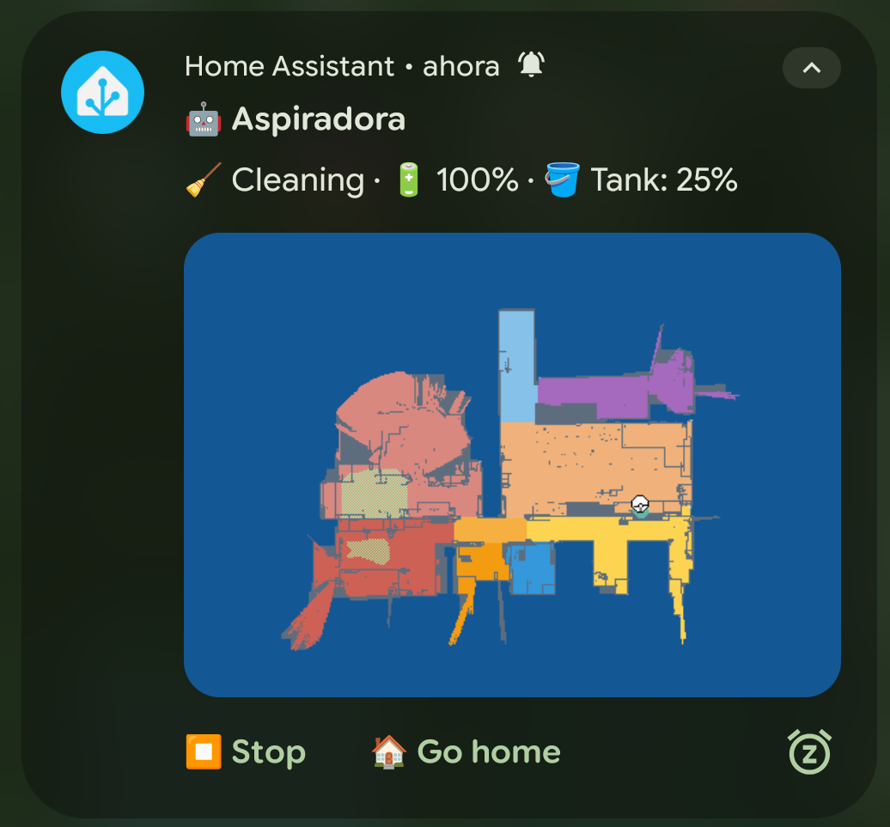
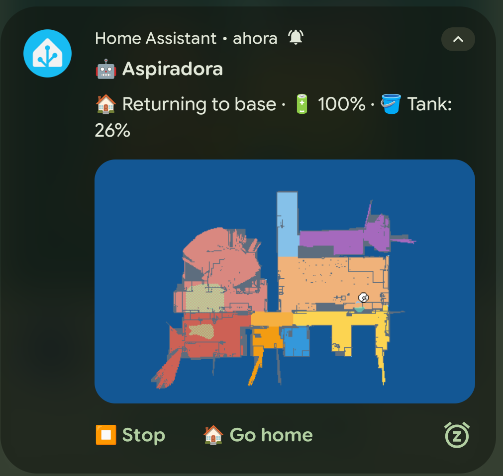
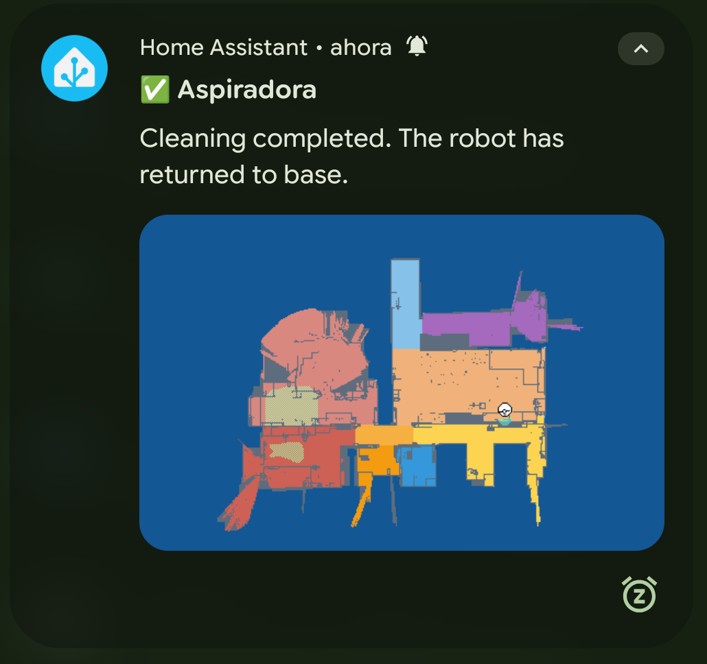

# 🤖 Vacuum Notification Card

Persistent Android notification card for robot vacuums. Shows live status, tank level and a live map snapshot while the vacuum is running. Sends a completion notification with the final map when the robot docks. Fully controllable from the notification itself.

> **Note:** This blueprint is optimized for Android. It is also functional on iOS but persistent/sticky behaviour and silent update channels are not supported on that platform.

---

## Screenshots





---

## Features

- Persistent notification while the vacuum is active (auto-dismissed on dock)
- Live map image updated on every battery level change during cleaning
- Optional tank percentage sensor displayed in the notification body
- Dynamic action button: **Stop** while cleaning, **Resume** when idle or paused
- **Go home** button always available
- Optimistic notification update on button press — immediate feedback without waiting for the robot to confirm
- Sound only on first notification (cleaning starts) and on completion — silent updates in between
- Completion notification with final map snapshot on dock
- Notification tag auto-generated from the vacuum entity ID — safe to run multiple instances
- Filters out `unavailable` and `unknown` state transitions to avoid spurious notifications

---

## Requirements

- A vacuum entity supported by Home Assistant's `vacuum` domain
- A camera entity exposing the live map (e.g. [Xiaomi Cloud Map Extractor](https://github.com/PiotrMachowski/Home-Assistant-custom-components-Xiaomi-Cloud-Map-Extractor))
- Home Assistant Companion App installed on the target Android device

---

## Inputs

| Input | Required | Description |
|---|---|---|
| **Vacuum Entity** | ✅ | Your robot vacuum entity (`vacuum.*`) |
| **Tank Percentage Sensor** | ❌ | Sensor reporting dust tank fill level (`sensor.*`). Leave empty if not available |
| **Map Image URL** | ✅ | Full URL to the live map camera snapshot (see note below) |
| **Notification Service** | ✅ | Target notify service, e.g. `notify.mobile_app_person1` or `notify.family` (see note below) |

---

## Notification Service

Any valid `notify.*` service works, including notification groups. Groups are not configurable through the UI and must be defined in `configuration.yaml`:

```yaml
notify:
  - name: family
    platform: group
    services:
      - service: mobile_app_person1
      - service: mobile_app_person2
```

After adding this, restart Home Assistant. The group will be available as `notify.family`.

> **Note:** When using a notification group, presence-based filtering is not applied — all group members will receive the notification regardless of their location.

---

## Notification Channels (Android only)

This blueprint uses two notification channels to control sound behaviour:

| Channel | Sound | Used for |
|---|---|---|
| `Vacuum Alerts` | ✅ Yes | Cleaning started, cleaning completed |
| `Vacuum Status` | ❌ No | State updates during cleaning, button feedback |

The channels are created automatically on first use. To configure sound, vibration or importance for each channel go to **Settings → Apps → Home Assistant → Notifications** on your Android device.

---

## Map Image URL

The map image must be reachable from the mobile device at the moment the notification is received. There are three scenarios:

**Local network only** — works only when the phone is on the same Wi-Fi as Home Assistant:
```
http://192.168.x.x:8123/api/camera_proxy/camera.your_map
```

**External access via DuckDNS** — works anywhere:
```
https://your-host.duckdns.org/api/camera_proxy/camera.your_map?token=YOUR_STATIC_TOKEN
```

**External access with dynamic token (recommended)** — the token is injected at runtime so it never expires:
```
https://your-host.duckdns.org/api/camera_proxy/camera.your_map?token={{ state_attr('camera.your_map', 'access_token') }}
```

> To find your camera's access token go to **Developer Tools → States**, search for your camera entity and look for the `access_token` attribute.

---

## Installation

<a href="https://my.home-assistant.io/redirect/blueprint_import/?blueprint_url=https://raw.githubusercontent.com/txitxo0/ha-blueprints/main/blueprints/automation/cleaning/vacuum_notification_card.yaml">
  
</a>

Or import manually:

1. Go to **Settings → Automations & Scenes → Blueprints**
2. Click **Import Blueprint**
3. Paste the URL of this file

---

## Notes

- The notification refreshes on every `battery_level` attribute change of the vacuum entity. This guarantees map and status updates during long cleaning sessions without requiring a dedicated tank sensor trigger. The same trigger also fires while the robot is charging, but the `docked` state filter prevents any unnecessary notification updates in that case
- The tank sensor is fully optional — if left empty, it is simply omitted from the notification body without affecting any other functionality
- The notification tag is derived from the vacuum entity ID, so multiple instances of this blueprint for different vacuums will not interfere with each other
- The completion notification is not persistent and can be dismissed with a swipe
- Notification channels (sound control) are an Android-only feature and are ignored on iOS
